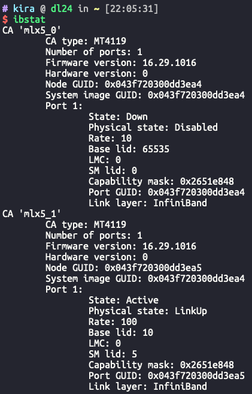
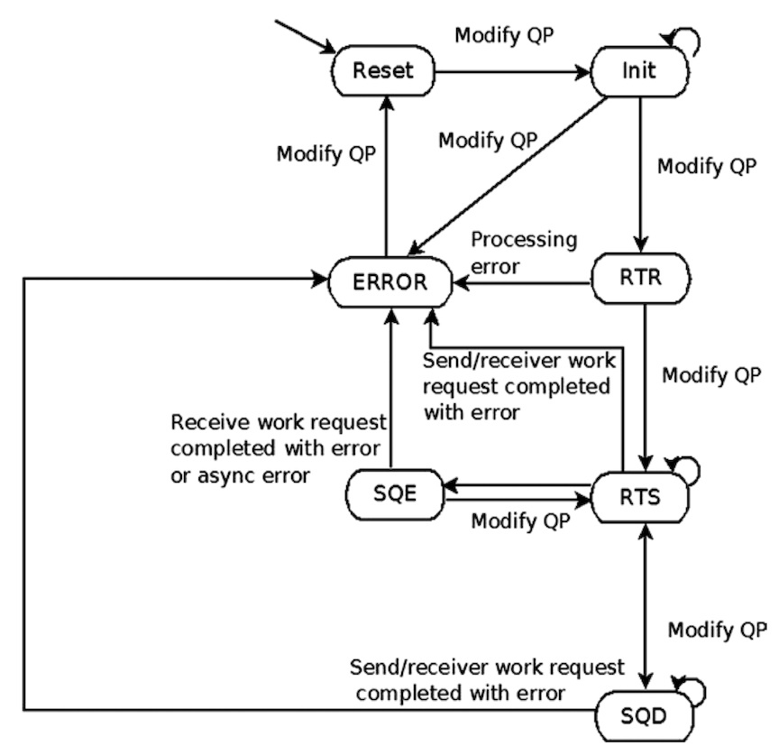

# Libibverbs API 编程

基于libibverbs的api，应用程序一般按照如下步骤组织：

1. Get the device list (`struct ibv_device **ibv_get_device_list()`)
2. **Create an Infiniband context** (`struct ibv_context* ibv_open_device()`)
3. Create a protection domain (`struct ibv_pd* ibv_alloc_pd()`)
4. Register a memory region (`ibv_reg_mr()`)
5. Create a completion queue (`struct ibv_cq* ibv_create_cq()`)
6. **Create a queue pair** (`struct ibv_qp* ibv_create_qp()`)
7. Exchange identifier information to establish connection
8. **Change the queue pair state** (`ibv_modify_qp()`): change the state of the queue pair from RESET to INIT, RTR (Ready to Receive), and finally RTS (Ready to Send) 
9. Exchange memory region information to handle operations
10. **Perform data communication**
11. clean up

注意：在一些应用程序或者文档中，第4步注册memory region作为初始化的一部分；事实上，**there is no problem for lazy registration** and memory regions can dynamically be registered and deregistered at any time before posting a work request


本文将上述基于libibverbs API的应用程序流程，划分以下三个大部分：初始化，连接QP，通信。


## 初始化

1. 应用程序通过API `ibv_get_device_list` 获取IB设备列表：

```c
/**
 * ibv_get_device_list - Get list of IB devices currently available
 * @num_devices: optional.  if non-NULL, set to the number of devices
 * returned in the array.
 *
 * Return a NULL-terminated array of IB devices.  The array can be
 * released with ibv_free_device_list().
 */
struct ibv_device **ibv_get_device_list(int *num_devices);
```


2. 遍历第一步得到的 IB devices list，根据设备名称或者GUID选择对应的设备，调用 `ibv_open_device` 打开IB设备，返回一个 `ibv_context` 对象。

```c
/**
 * ibv_open_device - Initialize device for use
 */
struct ibv_context *ibv_open_device(struct ibv_device *device);
```

注意 1： **双端口的IB网卡被视为两个设备** (此处指物理端口)



注意 2：在RDMA编程的语境下，`ib_port` 与网卡（HCA）的端口不是一个概念。正如上文所说，HCA的一个物理端口对应一个IB设备，`ib_port`是IB设备的子概念，如上图所示，每个CA都有一个port，其id为1。


3. 使用上一步得到的`ibv_context`创建PD

```c
/**
 * ibv_alloc_pd - Allocate a protection domain
 */
struct ibv_pd *ibv_alloc_pd(struct ibv_context *context);
```


4. 使用上一步创建的PD，register a memory region [这一步可以不在初始化阶段执行]

```c
/**
 * ibv_reg_mr - Register a memory region
 * @pd - protection domain, struct ibv_pd from ibv_alloc_pd
 * @addr - memory base address
 * @length - length of memory region in bytes
 * @access - access flags
 */
struct ibv_mr *ibv_reg_mr(struct ibv_pd *pd, void *addr,
			  size_t length, int access);
```

Access flags may be bitwise or one of the following enumerations:

```
IBV_ACCESS_LOCAL_WRITE           Allow local host write access
IBV_ACCESS_REMOTE_WRITE          Allow remote hosts write access
IBV_ACCESS_REMOTE_READ           Allow remote hosts read access
IBV_ACCESS_REMOTE_ATOMIC         Allow remote hosts atomic access
IBV_ACCESS_MW_BIND               Allow memory windows on this MR
```

Local read access is implied and automatic.


5. 创建CQ (一般只设置前两个参数，后三个参数设置NULL, NULL, 0)

```c
/**
 * ibv_create_cq - Create a completion queue
 * @context - Context CQ will be attached to
 * @cqe - Minimum number of entries required for CQ
 * @cq_context - (optional) Consumer-supplied context returned for completion events
 * @channel - (optional) Completion channel where completion events will be queued.
 *     May be NULL if completion events will not be used.
 * @comp_vector - (optional) Completion vector used to signal completion events.
 *     Must be >= 0 and < context->num_comp_vectors.
 */
struct ibv_cq *ibv_create_cq(struct ibv_context *context, int cqe,
			     void *cq_context,
			     struct ibv_comp_channel *channel,
			     int comp_vector);
```


6. 创建QP 

   含有许多重要的配置项，（1）QP的类型，（2）是否所有WR都产生CQE，（3）inline的设置

```c
enum ibv_qp_type {
	IBV_QPT_RC = 2,
	IBV_QPT_UC,
	IBV_QPT_UD,
	IBV_QPT_RAW_PACKET = 8,
	IBV_QPT_XRC_SEND = 9,
	IBV_QPT_XRC_RECV
};

struct ibv_qp_cap {
	uint32_t		max_send_wr;    // Maximum number of outstanding send requests in SQ
	uint32_t		max_recv_wr;    // Maximum number of outstanding receive requests (buffers) in RQ
	uint32_t		max_send_sge;   // Maximum number of scatter/gather elements (SGE) in a WR on SQ
	uint32_t		max_recv_sge;   // Maximum number of SGEs in a WR on RQ
  /* Send small messages as inline
	 * In RDMA devices which supports sending data as inline, sending small messages  	    	 * as inline will provide better latency since it eliminates the need of the RDMA 
	 * device to perform extra read (over the PCIe bus) in order to read the message 		
	 * payload.
   */
	uint32_t		max_inline_data;  // 重要！！！Maximum size in bytes of inline data on the send queue.
};

struct ibv_qp_init_attr {
	void		       *qp_context;     // optional
	struct ibv_cq	       *send_cq;  // can use the same CQ with recv_cq
	struct ibv_cq	       *recv_cq;  // can use the same CQ with send_cq
	struct ibv_srq	       *srq;    // optional
	struct ibv_qp_cap	cap;					// see struct ibv_qp_cap above
	enum ibv_qp_type	qp_type;      // see struct ibv_qp_type above
	int			sq_sig_all;             // 重要！！！如果这个标志位设置为1，所有的SR完成时都会产生一个对应的CQE。如果这个标志位设置为0，只有被设置过的SR才会产生CQE。
};

/**
 * ibv_create_qp - Create a queue pair.
 */
struct ibv_qp *ibv_create_qp(struct ibv_pd *pd,
			     struct ibv_qp_init_attr *qp_init_attr);
```

[注意](https://www.rdmamojo.com/2013/01/26/ibv_post_send/) 3：

Unfortunately, struct ibv_device_attr doesn't contain any attribute that specify the maximum INLINE data that can be sent.
When creating a QP, qp_init_attr->cap->max_inline_data is returned with the number of INLINE data that can be sent in this QP.


## 连接QP

完成上述的初始化步骤之后，QP处于Reset状态，是无法进行工作的。我们需要与另一个QP建立连接，使其正常工作。

IB needs to use **out-of-band communication** to connect QP. （鸡生蛋，蛋生鸡的问题） Commonly, **Sockets** are used to exchange QP related information.

根据后续通信操作类型的不同，需要传输的QP信息也有所差异，例如对于RDMA read/write操作，需要额外传输`raddr`和`raddr.rkey`信息。

传输完QP信息后，需要修改QP状态。 （正确的状态转化：Reset -> Init -> RTR -> RTS）



1. **交换QP信息**

需要交换的QP信息主要包括：

```c
struct xchg_qp_info {
	int lid; // local id
	int qpn; // qp number
	int psn;  // packet sequence number; optional
};
```

获取 lid:  a **local identifier** in the subnet where the HCA is assigned to. this is assigned to each ports by the subnet manager and **unique within its subnet**. For communications over the subnet, we can use GID (Global ID), but it will not be covered in this document. 

```c
uint16_t getLocalId(struct ibv_context* context, int ib_port) {
  ibv_port_attr port_attr;
  ibv_query_port(context, ib_port, &port_attr);
  return port_attr.lid;
}
```

获取 qpn

```c
uint32_t getQueuePairNumber(struct ibv_qp* qp) {
  return qp->qp_num;
}
```

设置 psn, 可选，默认设置为0. 类似于TCP，初始化一个随机数，作为序列号的初始值。

```c
psn = lrand48() & 0xffffff;
```


socket通信部分，此处省略


2. **修改QP状态**

```c
/*
	@qp - struct ibv_qp from ibv_create_qp
	@attr - QP attributes
	@attr_mask - bit mask that defines which attributes within attr have been set for this call
*/
int ibv_modify_qp(struct ibv_qp *qp, struct ibv_qp_attr *attr, enum ibv_qp_attr_mask
attr_mask)
  
  
struct ibv_qp_attr {
	enum ibv_qp_state	qp_state;
	enum ibv_qp_state	cur_qp_state;
	enum ibv_mtu		path_mtu;
	enum ibv_mig_state	path_mig_state;
	uint32_t		qkey;
	uint32_t		rq_psn;
	uint32_t		sq_psn;
	uint32_t		dest_qp_num;
	int			qp_access_flags;
	struct ibv_qp_cap	cap;
	struct ibv_ah_attr	ah_attr;
	struct ibv_ah_attr	alt_ah_attr;
	uint16_t		pkey_index;
	uint16_t		alt_pkey_index;
	uint8_t			en_sqd_async_notify;
	uint8_t			sq_draining;
	uint8_t			max_rd_atomic;
	uint8_t			max_dest_rd_atomic;
	uint8_t			min_rnr_timer;
	uint8_t			port_num;
	uint8_t			timeout;
	uint8_t			retry_cnt;
	uint8_t			rnr_retry;
	uint8_t			alt_port_num;
	uint8_t			alt_timeout;
	uint32_t		rate_limit;
};  
```


Reset -> Init 所需要设置的属性：

```c
qp_state // IBV_QP_STATEIBV_QPS_INIT
pkey_index // IBV_QP_PKEY_INDEXpkey index, normally 0
port_num // IBV_QP_PORTphysical port number (1...n)
qp_access_flags // IBV_QP_ACCESS_FLAGS access flags (see ibv_reg_mr)
```

Init -> RTR 所需要设置的属性：

```c
qp_state // IBV_QP_STATEIBV_QPS_RTR
path_mtu // IBV_QP_PATH_MTUIB_MTU_256
                           IB_MTU_512 (recommended value)
                           IB_MTU_1024
                           IB_MTU_2048
                           IB_MTU_4096

ah_attr // IBV_QP_AV an address handle (AH) needs to be created and filled in as appropriate. Minimally, ah_attr.dlid needs to be filled in.
dest_qp_num // IBV_QP_DEST_QPNQP number of remote QP.
rq_psn // IBV_QP_RQ_PSN starting receive packet sequence number (should match remote QP’s sq_psn)
max_dest_rd_atomic // IBV_MAX_DEST_RD_ATOMIC maximum number of resources for incoming RDMA requests
min_rnr_timer // IBV_QP_MIN_RNR_TIMER minimum RNR NAK timer (recommended value: 12)                           
```

RTR -> RTS 所需要设置的属性:

```c
qp_state // IBV_QP_STATEIBV_QPS_RTS
timeout // IBV_QP_TIMEOUTlocal ack timeout (recommended value: 14)
retry_cnt // IBV_QP_RETRY_CNTretry count (recommended value: 7)
rnr_retry // IBV_QP_RNR_RETRYRNR retry count (recommended value: 7)
sq_psn // IBV_SQ_PSN send queue starting packet sequence number (should match remote QP’s rq_psn)
max_rd_atomic // IBV_QP_MAX_QP_RD_ATOMIC number of outstanding RDMA reads and atomic operations allowed.
```


## 通信


`ibv_post_send`是用于发送SR的重要接口，其中`struct ibv_send_wr`定义了SR的操作类型，我们对其中的可配置项做出了详细的说明。

```c
/*
	Input parameters:
	@qp - struct ibv_qp from ibv_create_qp
	@wr - first work request (WR)
	Output parameters:
	@bad_wr - pointer to first rejected WR
*/

int ibv_post_send(struct ibv_qp *qp, struct ibv_send_wr *wr, struct ibv_send_wr **bad_wr)

struct ibv_send_wr {
	uint64_t		wr_id;  // Important！！！ user assigned work request ID
	struct ibv_send_wr     *next;  // pointer to next WR, NULL if last one.
	struct ibv_sge	       *sg_list;  // scatter/gather array for this WR
	int			num_sge;                    // number of entries in sg_list
	enum ibv_wr_opcode	opcode;  // IBV_WR_RDMA_WRITE
															 // IBV_WR_RDMA_WRITE_WITH_IMM
															 // IBV_WR_SEND
															 // IBV_WR_SEND_WITH_IMM
															 // IBV_WR_RDMA_READ
															 // IBV_WR_ATOMIC_CMP_AND_SWP
															 // IBV_WR_ATOMIC_FETCH_AND_ADD
  
  
	int			send_flags;   // IBV_SEND_FENCE      set fence indicator
											  // IBV_SEND_SIGNALED   send completion event for this WR. Only meaningful for QPs that had the sq_sig_all set to 0
  										  // IBV_SEND_SEND_SOLICITED  set solicited event indicator
  											// IBV_SEND_INLINE send data in sge_list as inline data.
  
 
	/* When opcode is *_WITH_IMM: Immediate data in network byte order.
	 * When opcode is *_INV: Stores the rkey to invalidate
	 */
	union {
		__be32			imm_data;        // immediate data to send in network byte order
		uint32_t		invalidate_rkey;
	};
	union {
		struct {
			uint64_t	remote_addr;     // remote virtual address for RDMA/atomic operations
			uint32_t	rkey;  // remote key (from ibv_reg_mr on remote) for RDMA operations.
		} rdma;
		struct {
			uint64_t	remote_addr;
			uint64_t	compare_add;  // compare value for compare and swap operation
			uint64_t	swap;    // swap value
			uint32_t	rkey;
		} atomic;
		struct {
			struct ibv_ah  *ah;     // address handle (AH) for datagram operations
			uint32_t	remote_qpn;   // remote QP number for datagram operations
			uint32_t	remote_qkey;  // Qkey for datagram operations
		} ud;
	} wr;
	union {
		struct {
			uint32_t    remote_srqn;  // shared receive queue (SRQ) number for the destination extended reliable connection (XRC). Only used for XRC operations.
		} xrc;
	} qp_type;
	union {
		struct {
			struct ibv_mw	*mw;
			uint32_t		rkey;
			struct ibv_mw_bind_info	bind_info;
		} bind_mw;
		struct {
			void		       *hdr;
			uint16_t		hdr_sz;
			uint16_t		mss;
		} tso;
	};
};
```


1. Send and Receive Op.


```c
#define APP_SEND_WRID 101

static int app_post_send(struct app_context *ctx) {
	struct ibv_sge list = {
		.addr	= (uintptr_t) ctx->buf,
		.length = ctx->size,
		.lkey	= ctx->mr->lkey
	};
	struct ibv_send_wr wr = {
		.wr_id	    = APP_SEND_WRID,
		.sg_list    = &list,
		.num_sge    = 1,
		.opcode     = IBV_WR_SEND,					// Important!  set communication op. here 
		.send_flags = IBV_SEND_SIGNALED,    // Important!  set signal & inline here
	};
	struct ibv_send_wr *bad_wr;
  return ibv_post_send(ctx->qp, &wr, &bad_wr);
}
```


```c
#define APP_RECV_WRID 102

static int app_post_recv(struct app_context *ctx, int n) {
	struct ibv_sge list = {
		.addr	= (uintptr_t) ctx->buf,
		.length = ctx->size,
		.lkey	= ctx->mr->lkey
	};
	struct ibv_recv_wr wr = {
		.wr_id	    = APP_RECV_WRID,
		.sg_list    = &list,
		.num_sge    = 1,
	};
	struct ibv_recv_wr *bad_wr;
	int i;

	for (i = 0; i < n; ++i)
		if (ibv_post_recv(ctx->qp, &wr, &bad_wr))
			break;

	return i;
}
```


2. RDMA read and write Op.

为了支持 RDMA的远程读写操作，**需要在交换QP信息时，同时交换MR的信息**。注意，MR在创建是需要设置对应的权限。

```c
struct ibv_mr {
	struct ibv_context     *context;
	struct ibv_pd	       *pd;
	void		       *addr;    // !!!!! important, need to exchange
	size_t			length;
	uint32_t		handle;
	uint32_t		lkey;
	uint32_t		rkey;					// !!!!! important, need to exchange
};

ibv_reg_mr(pd, buffer, size, 
           IBV_ACCESS_LOCAL_WRITE | 
           IBV_ACCESS_REMOTE_READ | 		
           IBV_ACCESS_REMOTE_WRITE);
```


```c
#define APP_RDMA_READ_WRID 103

static int app_post_read(struct app_context *ctx) {
	struct ibv_sge list = {
		.addr	= (uintptr_t) ctx->buf,
		.length = ctx->size,
		.lkey	= ctx->mr->lkey
	};
	struct ibv_send_wr wr = {
		.wr_id	    = APP_RDMA_READ_WRID,
		.sg_list    = &list,
		.num_sge    = 1,
		.opcode     = IBV_WR_RDMA_READ,		// Important!  set communication op. here 
		.send_flags = IBV_SEND_SIGNALED,    // Important!  set signal & inline here
    .wr.rdma.remote_addr = ctx->addr,
    .wr.rdma.rkey = ctx->rkey
	};
	struct ibv_send_wr *bad_wr;
  return ibv_post_send(ctx->qp, &wr, &bad_wr);
}
```


```c
#define APP_RDMA_WRITE_WRID 104

static int app_post_write_unsignaled(struct app_context *ctx) {
	struct ibv_sge list = {
		.addr	= (uintptr_t) ctx->buf,
		.length = ctx->size,
		.lkey	= ctx->mr->lkey
	};
	struct ibv_send_wr wr = {
		.wr_id	    = APP_RDMA_WRITE_WRID,
		.sg_list    = &list,
		.num_sge    = 1,
		.opcode     = IBV_WR_RDMA_WRITE,		// Important!  set communication op. here 
    .wr.rdma.remote_addr = ctx->addr,
    .wr.rdma.rkey = ctx->rkey
	};
	struct ibv_send_wr *bad_wr;
  return ibv_post_send(ctx->qp, &wr, &bad_wr);
}
```


3. Poll CQ

当设备完成操作后，它会创建一个对应的work completion (wc) entry插入到CQ中。

基本上，我们通过轮询的方式来检查操作是否完成。

注意，Polling is not the only way of work completion detection. RDMA provides a notification mechanism, however, polling usually is faster (low latency) for detection, as notification requires several context switches, process scheduling, etc.

```c
/*
 * Input Parameters:
 * @cq - struct ibv_cq from ibv_create_cq
 * @num_entries - maximum number of completion queue entries (CQE) to return
 * Output Parameters:
 * @wc - CQE array
 * Return value:
 * Number of CQEs in array wc or -1 on error
 */
int ibv_poll_cq(struct ibv_cq *cq, int num_entries, struct ibv_wc *wc)
```


编程模型

```c
void pollCompletion(struct ibv_cq* cq) {
  struct ibv_wc wc;
  int result;

  do {
    // ibv_poll_cq returns the number of WCs that are newly completed,
    // If it is 0, it means no new work completion is received.
    // Here, the second argument specifies how many WCs the poll should check,
    // however, giving more than 1 incurs stack smashing detection with g++8 compilation.
    result = ibv_poll_cq(cq, 1, &wc);
  } while (result == 0);

  if (result > 0 && wc.status == ibv_wc_status::IBV_WC_SUCCESS) {
    // success
    for (i = 0; i < ne; ++i) {
      ret = process_single_wc(wc[i].wr_id, wc[i].status, ... );
      if (ret) {
        fprintf(stderr, "parse WC failed %d\n", ne);
        return 1;
      }
    }
  } else {
      // You can identify which WR failed with wc.wr_id.
  	printf("Poll failed with status %s (work request ID: %llu)\n", ibv_wc_status_str(wc.status), wc.wr_id);
  }
}
```


