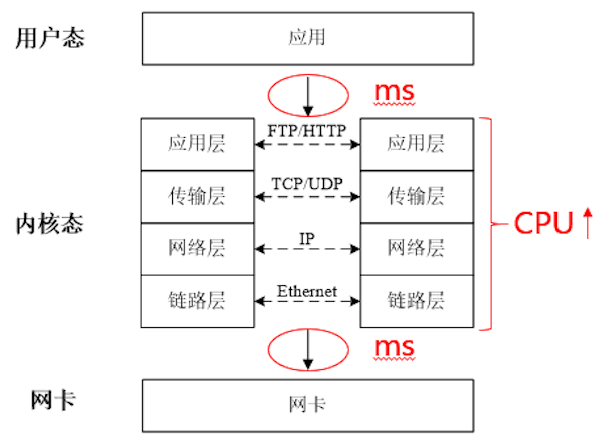
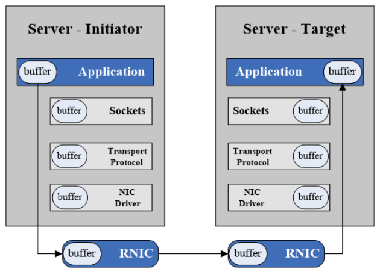

# RDMA 技术背景及原理

## 背景

随着以太网的提速，TCP/IP 协议基于软件协议栈传输的这种方式（图1）已经无法适应高速数据传输的需求，成为网络性能进一步增长的瓶颈。应用数据在用户态和内核态之间的拷贝带来ms级的延时，协议栈对数据包的解析、寻址、校验等操作需要消耗大量CPU资源。

普通网卡的工作过程如下：先把收到的数据包缓存到系统上，数据包经过处理后，相应数据被分配到一个TCP连接。然后，接收系统再把主动提供的TCP数据同相应的应用程序联系起来，并将数据从系统缓冲区拷贝到目标存储地址。这样，制约网络速率的因素就出现了：应用通信强度不断增加和主机CPU 在内核与应用存储器间处理数据的任务繁重，使系统要不断追加主机CPU 资源，配置高效的软件并增强系统负荷管理。

新型的网络技术替代了传统的TCP/IP软件协议栈的设计，核心技术就是RDMA，全称是远程直接内存访问，实现了kernel bypass技术，数据不需要经过软件协议栈，并且不需要CPU参与寻址、解析等操作，从而提供低延时、高带宽、低CPU使用的性能优势：

- Remote：远程服务器之间的数据交换
- Direct：内核旁路技术、协议栈下发到网卡
- Memory：用户态应用虚拟内存
- Access：SEND/RECV，READ，WRITE等操作

如下图所示，从RDMA的宏观传输图中，我们可以看到，数据直接从用户态发送给网卡，再由网卡中的协议栈进行转发到达目标端用户态内存，整个过程完全旁路了内核，不需要用户态到内核态的数据拷贝，降低了延时，同时不经过软件协议栈，也就不需要CPU参与寻址等操作，减少了CPU的使用。

## RDMA技术

目前主要有三种技术支持RDMA： InfiniBand， Ethernet RoCE 以及 Ethernet iWARP。 这些技术使用相同的用户态API，但是底层使用不同物理链路。

**（1）InfiniBand**

InfiniBand (IB) is a high-speed, low latency, low CPU overhead, highly efficient and scalable **server and storage interconnect technology**.

IB在主机间传输数据时不需要CPU参与，通过使用I/O channels （up to 16 million per host）传输数据，每个channel都提供虚拟网卡或者HCA的语义能力。

由IBTA组织制定相关标准

**（2）Ethernet RoCE**

RoCE是基于以太网的RDMA解决方案，同样由IBTA组织制定相关标准。

RoCE不需要复杂并且低性能的TCP传输。

It takes advantage of **Priority Flow Control** in Data Center Bridging Ethernet for **lossless connectivity**.

**（3）Ethernet iWARP**

When it comes to the Ethernet solutions, **RoCE has clear performance advantages over iWARP** — both for latency, throughput and CPU overhead. 

【感觉很鸡肋】

### IB关键组件 

**HCA** - Host Channel Adapter:  (类似于以太网中的网卡，但是提供更多的功能)

HCAs provide **address translation mechanism** under the control of the operating system which allows an application to access the HCA directly.

**Switches** 

They implement **flow control of the IB Link Layer to prevent packet dropping**, and to support congestion avoidance and adaptive routing capabilities, and advanced Quality of Service. 

基本都包含 Subnet Manager

**Subnet Manager** 

The InfiniBand subnet manager assigns **Local Identifiers (LIDs)** to each port connected to the InfiniBand fabric and develops a routing table based on the assigned LIDs. The IB Subnet Manager is a concept of Software Defined Networking (SDN) which eliminates the interconnect complexity and enables the creation of very large scale compute and storage infrastructures.

**Range Extenders** （不重要）

InfiniBand range extension is accomplished by encapsulating the InfiniBand traffic onto the WAN link and extending sufficient buffer credits to ensure full bandwidth across the WAN.

**Cables**

IB既支持铜缆也支持光缆，在短距离的传输场景下，二者的带宽延迟基本没有差别，长距离传输需要使用光缆。 （光缆的价格远高于铜缆）

